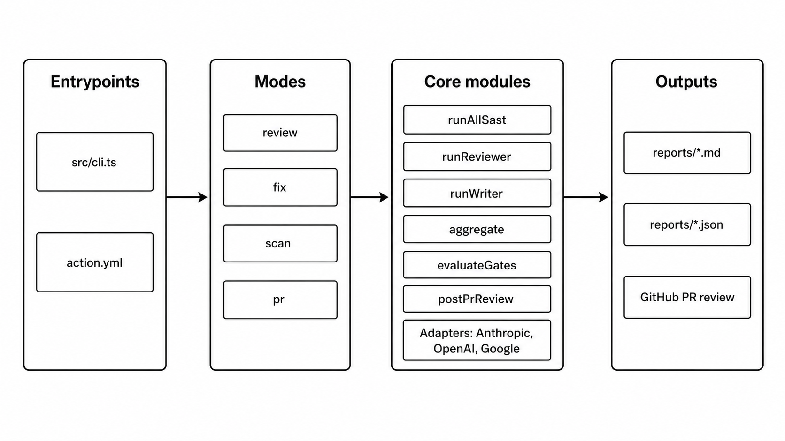

# secure-review

[](https://www.npmjs.com/package/secure-review)
[](https://www.npmjs.com/package/secure-review)
[](LICENSE)

**Multi-model security review for AI-generated code.** CLI and GitHub Action that runs several LLM reviewers (Anthropic, OpenAI, Google) and SAST tools (Semgrep, ESLint, npm audit) against your codebase. Findings are aggregated across reviewers — overlap becomes a confidence signal. Modes: `scan` (SAST only), `review` (multi-model report), `fix` (cross-model rotating loop applies fixes), `pr` (GitHub Action entrypoint), `estimate` (preview cost without running), `baseline` (mark known/accepted findings), `benchmark` (compare writer models), `compare` (A/B path diff), `reviewer-benchmark` (single vs multi-model reviewer comparison).

```bash
npm install --save-dev secure-review        # https://www.npmjs.com/package/secure-review
npx secure-review init                      # interactive scaffold
npx secure-review review ./src              # report — no file changes
npx secure-review fix ./src                 # report + apply fixes via cross-model loop
```

> **How it actually works under the hood** — see [WORKFLOW.md](WORKFLOW.md) for the full per-mode pseudo-code (read this if you're evaluating the methodology, not just running the tool).

The design is grounded in recent LLM-security research showing that (1) SAST alone is nearly blind to AI-generated code, and (2) same-model self-review loops often regress. The tool operationalizes the cross-model-review pattern the industry uses informally.

## Why this, not GitHub Copilot PR review?

| | GitHub Copilot code review | secure-review |
|---|---|---|
| Models | 1 (OpenAI via Copilot) | N, any provider |
| Security-specialized | No (general quality) | Yes (skill-configurable) |
| Agreement signal across models | No | Yes |
| SAST integrated with AI | No | Yes (Semgrep + ESLint + npm audit) |
| Provider-agnostic | No (Copilot only) | Yes |
| Empirical justification | Marketing | Grounded in LLM-security research (see below) |

## Quick start — CLI

```bash
npm install --save-dev secure-review
npx secure-review init        # interactive scaffold: .secure-review.yml + .env or .env.example
# if init created .env.example: cp .env.example .env
# edit .env — paste your API keys
npx secure-review review ./src
```

`.env` in the current directory is auto-loaded — no `source .env` needed.

`init` asks a few yes/no questions (which providers, enable SAST, enter keys now or later) and drops a working config + env file. Use `--yes` to skip the prompts and accept all defaults; that non-interactive path writes `.env.example`, so copy it to `.env` and fill in the keys before running an AI-backed mode.

### Other CLI subcommands

| Command | Purpose |
|---|---|
| `secure-review init` | Scaffold `.secure-review.yml` + `.env` or `.env.example` + optional GitHub Actions workflow |
| `secure-review scan <path>` | SAST only — no AI calls, no API keys needed |
| `secure-review review <path>` | Multi-model review, no file changes |
| `secure-review fix <path>` | Iterative review → write → re-review loop |
| `secure-review estimate <path> [--mode review\|fix]` | Print a pre-run cost estimate without invoking any model |
| `secure-review baseline <findings.json> [--merge] [--reason ...]` | Create or update a `.secure-review-baseline.json` of known/accepted findings to suppress in subsequent runs |
| `secure-review benchmark <path>` | Compare multiple writer models head-to-head on fix quality |
| `secure-review compare <pathA> <pathB>` | Side-by-side security diff of two codebases |
| `secure-review reviewer-benchmark <path>` | Show what each single model misses vs the combined multi-model ensemble |
| `secure-review setup-secrets` | Push API keys from local `.env` to GitHub Action secrets via `gh` CLI |
| `secure-review pr` | GitHub Action entry point (called by the workflow) |

> **One key is enough.** You don't need keys for all three providers — secure-review runs with as few as **one reader**, as long as the writer also uses an enabled provider. Disable any provider during `init` (or remove its entry from `.secure-review.yml`) and the tool simply doesn't instantiate that provider. This is useful if you only have an OpenAI key, or want to keep cost down to a single provider.

## Quick start — GitHub Action

```yaml
# .github/workflows/secure-review.yml
name: Secure Review
on: pull_request
permissions:
  contents: read
  pull-requests: write
  checks: write
jobs:
  review:
    runs-on: ubuntu-latest
    if: github.event.pull_request.head.repo.fork == false
    steps:
      - uses: actions/checkout@v4
        with: { fetch-depth: 0 }
      - uses: actions/setup-node@v4
        with: { node-version: 20 }
      - run: npm ci
      - uses: fonCki/secure-review@v1
        env:
          ANTHROPIC_API_KEY: ${{ secrets.ANTHROPIC_API_KEY }}
          OPENAI_API_KEY:    ${{ secrets.OPENAI_API_KEY }}
          GOOGLE_API_KEY:    ${{ secrets.GOOGLE_API_KEY }}
          GITHUB_TOKEN:      ${{ secrets.GITHUB_TOKEN }}
```

Open a PR — a single review is posted, with inline comments for findings that land on GitHub-commentable diff lines and summary text for changed-file findings outside those lines.

### Setting GitHub Action secrets

You need to set the API keys as GitHub repo secrets so the action can authenticate with the providers. Two ways:

**A) Automated** (requires `gh` CLI installed and `gh auth login` done):
```bash
npx secure-review setup-secrets
# Reads keys from .env, sets one secret per enabled provider via `gh secret set`.
# Use --repo owner/name if not running inside a clone.
```

**B) Manual** (always works):
```bash
gh secret set ANTHROPIC_API_KEY    # paste when prompted
gh secret set OPENAI_API_KEY
gh secret set GOOGLE_API_KEY
```

Or via the web UI: `https://github.com/<owner>/<repo>/settings/secrets/actions` — click *New repository secret* for each key.

Only set secrets for providers you actually enabled. If you only use OpenAI, just `OPENAI_API_KEY`. `GITHUB_TOKEN` is auto-provided by Actions — don't set it.

## Config (`.secure-review.yml`)

```yaml
writer:
  provider: anthropic
  model: claude-sonnet-4-6
  skill: skills/secure-node-writer.md

reviewers:
  - name: codex-web-sec
    provider: openai
    model: gpt-5-codex
    skill: skills/web-sec-reviewer.md
  - name: sonnet-owasp
    provider: anthropic
    model: claude-sonnet-4-6
    skill: skills/owasp-reviewer.md
  - name: gemini-dependencies
    provider: google
    model: gemini-2.5-pro
    skill: skills/dependency-reviewer.md

sast:
  enabled: true
  tools: [semgrep, eslint, npm_audit]
  inject_into_reviewer_context: true   # reviewers see SAST findings

review:
  parallel: true

fix:
  mode: sequential_rotation             # verifier = reviewers[i % len] each iteration
  max_iterations: 3
  final_verification: all_reviewers
  min_confidence_to_fix: 0             # only send findings with confidence >= this (0 = all)
  min_severity_to_fix: INFO            # only send findings at or above this severity (INFO = all)

# Optional: list additional writer models to benchmark head-to-head
writers:
  - provider: anthropic
    model: claude-sonnet-4-6
    skill: skills/secure-node-writer.md
  - provider: openai
    model: gpt-4o
    skill: skills/secure-node-writer.md

gates:
  block_on_new_critical: true
  max_cost_usd: 20
  max_wall_time_minutes: 15
```

Every reviewer is a `{provider, model, skill}` triple. Skills are Markdown files defining the reviewer's role (web-sec pen-tester, OWASP auditor, supply-chain specialist, etc.). Write your own by copying `skills/*.md`.

## Environment

```
ANTHROPIC_API_KEY=...
OPENAI_API_KEY=...
GOOGLE_API_KEY=...

# Local dev: use the provider's CLI binary instead of API (Claude Max / Gemini CLI subscription).
# GitHub Actions runners: must be api (factory refuses cli mode in runners).
ANTHROPIC_MODE=api        # api | cli
OPENAI_MODE=api           # api only
GOOGLE_MODE=api           # api | cli

# For `secure-review pr`
GITHUB_TOKEN=...
```

## Modes

> Each mode below is the friendly summary. For the full per-step pseudo-code, see [WORKFLOW.md](WORKFLOW.md).

### `scan` — SAST only

```bash
secure-review scan ./src
```

Runs Semgrep, then ESLint, then npm audit, and normalizes their output to the same `Finding` schema the AI readers use. No LLM calls, no API keys required. Cheapest pre-commit triage.

### `review` — multi-model parallel one-shot

```bash
secure-review review ./src                 # full scan (asks before running once cost is shown)
secure-review review ./src --since main    # only files changed since `main`
secure-review review ./src --baseline none # ignore any local .secure-review-baseline.json
secure-review review ./src --yes           # skip the cost-estimate prompt
```

SAST runs first, then every reader (e.g. anthropic-haiku + openai-mini + gemini-flash) scans the **same code** with the SAST findings passed as prior context when enabled. Reviewers run in parallel by default; set `review.parallel: false` in `.secure-review.yml` to run them sequentially. Findings are deduped by `{file, line-bucket}` — overlapping findings at the same location merge regardless of CWE or title (models assign different CWEs to the same bug), and `reportedBy` accumulates names. Confidence per finding is `min(1, |reportedBy| / 3)`, so a finding flagged by 2 of 3 reporters is high-confidence. The report sorts findings by agreement count descending and highlights multi-model agreement with a badge.

If a `.secure-review-baseline.json` is present in the scan root (or `--baseline <path>` is set), findings whose fingerprint matches an entry are excluded from the headline `findings` array (still recorded under `baselineSuppressed` for transparency). With `--since <ref>`, only files changed since that git ref are reviewed — useful on iterative PR workflows where the full tree hasn't changed.

No file mutations. Output: `reports/review-<timestamp>.{md,json}`.

### `fix` — cross-model rotating loop *(0.5.0+ semantics)*

```bash
secure-review fix ./src --max-iterations 3 --max-cost-usd 20
secure-review fix ./src --since main                  # only files changed since `main`
secure-review fix ./src --baseline ./baseline.json    # use a specific baseline file
secure-review fix ./src --yes --no-estimate           # CI-friendly: skip prompt + skip preview
```

The mode that actually fixes things. Three phases:

1. **Initial union scan** — SAST runs first, then *all* readers run in parallel. The aggregated union becomes the writer's iter-1 to-do list (no reader's blind spots get a free pass).
2. **Iteration loop** (rotating verifier per iter):
   - Step A: Writer applies fixes for the current findings list (iter 1: union; iter 2+: previous verifier's audit).
   - Step B: Next reader in rotation audits the writer's output with fresh eyes (different model = different blind spots).
   - Step C: Baseline filter + stable-ID annotation, then the audit becomes the next iteration's input.
   - The loop only exits when **N consecutive verifiers** all see clean (full rotation), or a gate fires (`block_on_new_critical`, `max_cost_usd`, `max_wall_time_minutes`), or divergence is detected.
3. **Final verification** — by default, all readers in parallel re-scan the final state. Catches anything the per-iteration verifiers missed individually.

The writer is **always the same model**; the verifier rotates. This prevents the writer from drifting toward "code that satisfies one specific model" — every iteration a different judge shows up.

**Safety controls:**
- **Pre-run cost estimate** — before any model call, print a token-cost projection per model (point + ±30% band) and (in interactive shells) prompt for confirmation. `--yes` skips the prompt; `--no-estimate` skips the preview entirely. In CI / non-TTY contexts the estimate is printed but the run proceeds without prompting (`gates.max_cost_usd` remains the budget contract). Standalone preview: `secure-review estimate ./src --mode fix`.
- **Baseline / FP suppression** — findings whose fingerprint matches `.secure-review-baseline.json` are filtered before the writer ever sees them and never appear in the `remaining` set, so the loop spends only on net-new issues.
- **Stable finding IDs across iterations** — every finding is assigned a session-scoped `S-NNN` keyed on `{file, line-bucket}`. The same bug keeps the same ID even when the verifier rephrases it, so the per-iteration `resolved` and `introduced` deltas in the report reflect actual writer effects, not relabeling.
- **Rollback** — if the writer introduces a new CRITICAL finding *and* a gate fires, the loop rolls back to the pre-iteration snapshot before stopping. New files created by the writer are also removed.
- **Divergence detection** — if total findings grow for 2 consecutive iterations, the loop stops to prevent regression spirals (the F2 failure mode).
- **Filtering** — configure `min_confidence_to_fix` and `min_severity_to_fix` in the config to limit what the writer attempts (e.g. only fix HIGH+ findings with ≥50% confidence).
- **Incremental mode** — `--since <ref>` restricts the entire pipeline (SAST + readers + writer + final verification) to files Git reports as changed since that ref.

> Earlier versions (pre-0.5.0) used a different loop: each iteration's reviewer scanned alone, single-reviewer-zero exited the loop early, and the initial scan was a vanity baseline metric. See [CHANGELOG.md](CHANGELOG.md) for the migration notes.

Output: `reports/fix-<timestamp>.{md,json}` plus modified source files.

### `benchmark` — compare writer models

```bash
secure-review benchmark ./src
```

Runs the initial full scan to get a baseline finding set, then for each writer model configured under `writers:` in the config: applies one round of fixes, re-scans with all reviewers, measures how many findings were resolved vs introduced, and restores files before running the next writer. Produces a markdown comparison table.

```yaml
# .secure-review.yml — add a writers array to benchmark multiple models
writers:
  - provider: anthropic
    model: claude-sonnet-4-6
    skill: skills/secure-node-writer.md
  - provider: openai
    model: gpt-4o
    skill: skills/secure-node-writer.md
```

Output: `reports/benchmark-<timestamp>.md`

### `compare` — A/B path security diff

```bash
secure-review compare ./v1 ./v2
```

Reviews two directories in parallel and produces a side-by-side report: findings unique to A, findings unique to B, findings common to both, and an overall delta (`better` / `worse` / `same`). Useful for comparing AI-generated vs human-written code, or before/after a refactor.

Output: `reports/compare-<timestamp>.md`

### `reviewer-benchmark` — single vs combined multi-model

```bash
secure-review reviewer-benchmark ./src
```

Answers the question: *what does each individual model miss that the ensemble catches?* Runs each configured reviewer in isolation (+ SAST), then compares against the full multi-model aggregate. The report shows:

- Per-model blind spot percentage (findings in combined that the solo model missed)
- Unique contributions per model (findings only that model found)
- Multi-model agreement breakdown on the combined finding set

This is the empirical justification for the multi-model design — no single model catches everything.

Output: `reports/reviewer-benchmark-<timestamp>.md`

### `pr` — GitHub Action entrypoint

Runs `review` mode on the full checkout, then filters the aggregated findings against the PR diff before posting a single review. Findings are split into three buckets:

- **inline** — finding on a changed line in a changed file → posted as inline comment
- **summary** — finding in a changed file but on an unchanged line → mentioned in the review summary
- **dropped** — finding in an untouched file → not posted

Fork PRs are skipped by default (forks don't have secret access). Fails the check if any CRITICAL finding lands on a diff line.

## Architecture



For the per-mode runtime flow (sequence diagrams, state diagrams, full pseudo-code), see [WORKFLOW.md](WORKFLOW.md).

## Evidence JSON

Every run emits a self-contained JSON with per-iteration counts and severity breakdowns — suitable for plotting, diffing across runs, or feeding into dashboards:

```json
{
  "task_id": "my-app",
  "tool": "secure-review",
  "condition": "F-fix",
  "run": 1,
  "timestamp": "2026-04-28T12:00:00.000Z",
  "model_version": "claude-sonnet-4-6|gpt-5-codex+claude-sonnet-4-6+gemini-2.5-pro",
  "total_findings_initial": 12,
  "findings_by_severity_initial": { "CRITICAL": 1, "HIGH": 3, "MEDIUM": 5, "LOW": 2, "INFO": 1 },
  "total_findings_after_fix": 4,
  "findings_by_severity_after_fix": { "CRITICAL": 0, "HIGH": 1, "MEDIUM": 2, "LOW": 1, "INFO": 0 },
  "new_findings_introduced": 1,
  "findings_resolved": 9,
  "resolution_rate_pct": 75.0,
  "semgrep_after_fix": 0,
  "eslint_after_fix": 0,
  "lines_of_code_fixed": 0,
  "reviewers": ["codex-web-sec", "sonnet-owasp", "gemini-dependencies"],
  "iterations": 3,
  "per_iteration": [...]
}
```

The same schema is used by both `review` and `fix` modes. Review-only runs use `condition: "F-review"` and set the before/after finding counts to the same values because no fixes are applied.

## Developing

```bash
npm install
npm run typecheck
npm test
npm run build         # library (dist/)
npm run build:action  # Action bundle (dist-action/index.js) — commit with PRs that touch src/
```

## License

MIT © 2026 Alfonso Pedro Ridao, Shana Stampfli
