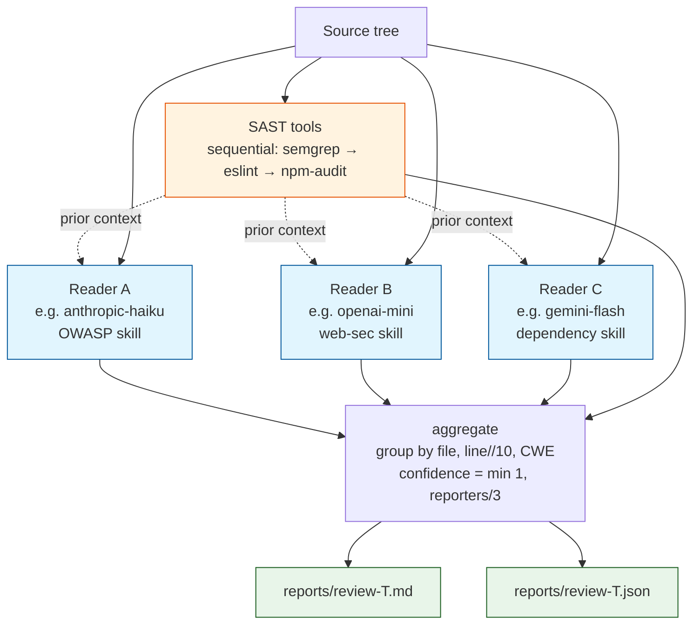
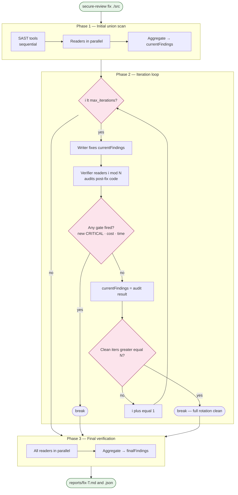
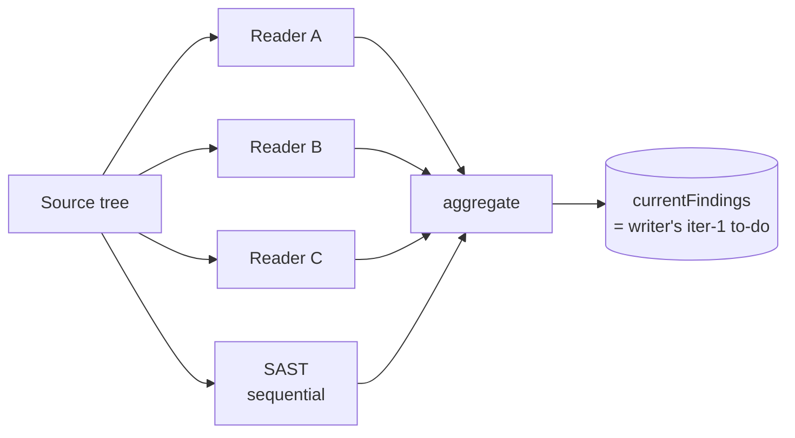
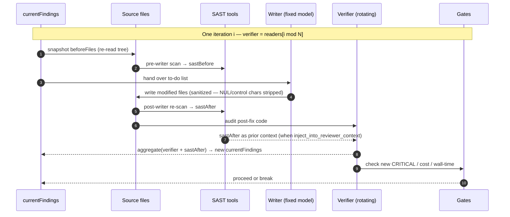
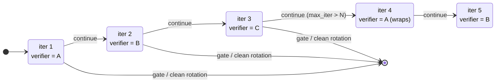
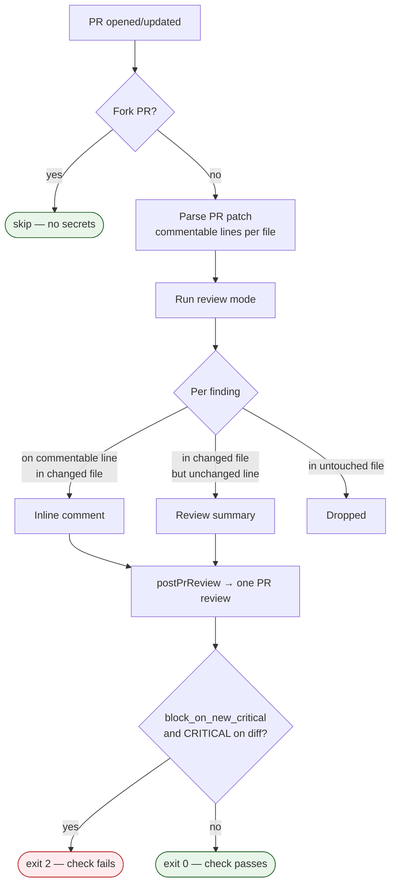

# Workflow

How `secure-review` actually executes each mode. Pseudo-code matches the source — every step here corresponds to real code in `src/modes/` and `src/roles/`.

---

## Roles

Two distinct roles. They never overlap.

| Role | Reads code? | Edits files? | Count |
|---|---|---|---|
| **Reader** (reviewer) | Yes — analyzes files, reports findings | **No** | 1..N (configured) |
| **Writer** | Reads code as context | **Yes — the only role that modifies files** | Exactly 1 |

A "reader" and a "writer" can be the **same model** with different system prompts (skills) — they're distinct *roles*, not distinct models. In the default config, OpenAI `gpt-4o-mini` appears once as a reader (with `web-sec-reviewer.md` skill) and could appear again as the writer (with `secure-node-writer.md` skill). Different jobs, same brain.

---

## `scan` mode — SAST only

The simplest mode. No LLM calls, no API keys required.


<details><summary>Pseudo-code</summary>

```
1. Read source tree
2. Run each enabled SAST tool sequentially (in src/sast/index.ts order):
     - semgrep (auto config)
     - eslint  (uses your project's config; tool exits early if no eslint.config.js)
     - npm audit (only if package.json exists)
3. Normalize each tool's output to the unified Finding schema
4. Print summary as JSON to stdout; no report file written
```
</details>

> SAST tools run sequentially rather than in parallel — they're typically I/O- and CPU-light, the orchestration overhead of `Promise.all` rarely pays off, and sequential execution makes failure attribution easier.

Use it when you want a fast, free, AI-free triage.

---

## `review` mode — multi-model parallel one-shot

Every reader scans the same code at the same time. Findings are merged by `{file, line-bucket, CWE}`. Confidence per finding is `min(1, |reportedBy| / 3)` so a finding flagged by 2 of 3 readers is high-confidence.



<details><summary>Pseudo-code</summary>

```
1. Read source tree
2. Run all SAST tools (sequential — semgrep, then eslint, then npm-audit)
3. Run readers — parallel if config.review.parallel == true (default), otherwise
   sequential. Each reader receives:
                    - the code
                    - the SAST findings as prior context (if config.sast.inject_into_reviewer_context)
                    - its own role-specific skill prompt
4. Aggregate:
     allFindings = union(reader_A.findings,
                         reader_B.findings,
                         reader_C.findings,
                         SAST.findings)
     deduped     = group by {file, line-bucket, CWE}
                   merge overlaps; reportedBy = union of names
                   confidence = min(1, |reportedBy| / 3)
5. Write report (markdown + JSON evidence)
```
</details>

**Output**: `reports/review-<timestamp>.{md,json}`. No file mutations.

**When to use**: any time you want a security report on a codebase without changing it. Cheapest mode that uses LLMs.

---

## `fix` mode — cross-model rotating loop (REDESIGNED in 0.5.0)

The mode that does the actual work of fixing security issues. It uses **rotation across iterations** so the writer can never settle into "code that satisfies one specific model" — every iteration a different reader audits with fresh eyes / different blind spots.

> **0.5.0+ semantics** — if you read older docs (or a fork on an older version), the fix-mode loop worked differently before. See [CHANGELOG.md](CHANGELOG.md) for the migration notes. The pseudo-code below describes 0.5.0+ only.

### High-level: all three phases at a glance



### Phase 1: Initial union scan



<details><summary>Pseudo-code</summary>

```
SAST(files)                          # sequential SAST tools
initialFindings = aggregate(
    reader_A.review(files) +         # readers run in PARALLEL (Promise.all)
    reader_B.review(files) +
    reader_C.review(files) +
    SAST.findings
)
currentFindings = initialFindings    # ← becomes the writer's iter-1 to-do list
                                     # (so no reader's blind spots get a free pass)
```
</details>

> SAST runs sequentially before the parallel reader fan-out. Readers always run in parallel in `fix` mode (no opt-out), so the `config.review.parallel` flag has no effect here.

### Phase 2: Iteration loop

#### One iteration in time



#### Rotation across iterations (sequential_rotation, N=3)



The writer is always the same model (configured in `writer:`). Only the verifier rotates. With `max_iterations >= N`, every reader audits at least once — guaranteeing cross-model coverage.

<details><summary>Pseudo-code</summary>

```
let consecutiveCleanIters = 0
let N = number of readers

for i in 0 .. (max_iterations - 1):
    # Rotation policy (config.fix.mode):
    #   "sequential_rotation" (default): verifier = readers[i % N]
    #   "parallel_aggregate":             verifier = readers[0]   # always first; no rotation
    verifier = pickReviewer(readers, i, config.fix.mode)

    # Step A: Writer applies fixes (writer is fixed; same model every iteration)
    if currentFindings.length > 0:
        writerRun = writer.fix(currentFindings)   # writes files with sanitization
                                                  # (NUL/control chars stripped)
    # else: skip writer call; verifier still runs to confirm clean state

    # Step B: Verifier audits (rotating reader = fresh eyes)
    sastAfter   = run all SAST tools
    afterFiles  = re-read source tree
    verifierRun = verifier.review(afterFiles, prior=sastAfter.findings)

    findingsAfter = aggregate(verifierRun + sastAfter)

    # Step C: Bookkeeping
    diff = compare(currentFindings, findingsAfter)
        .resolved   = in input but not in audit
        .introduced = in audit but not in input
        .newCritical = introduced.filter(severity == CRITICAL).count

    # Step D: Gate evaluation — break early on any condition
    if config.gates.block_on_new_critical and newCritical > 0:    break
    if cumulativeCost > config.gates.max_cost_usd:                break
    if elapsedMs / 60000 > config.gates.max_wall_time_minutes:    break

    # Step E: Set up next iteration
    currentFindings = findingsAfter

    # Step F: Stability check — only exit when N consecutive iters all clean
    if findingsAfter.empty:
        consecutiveCleanIters += 1
        if consecutiveCleanIters >= N: break    # ← full rotation clean
    else:
        consecutiveCleanIters = 0
```
</details>

### Phase 3: Final verification (parallel)

```
if config.fix.final_verification == 'all_reviewers':
    finalScan = parallel(reader.review(finalFiles) for reader in readers)
    finalFindings = aggregate(finalScan + SAST(finalFiles))
elif config.fix.final_verification == 'first_only':
    finalFindings = readers[0].review(finalFiles) + SAST(finalFiles)
# else 'none': skip
```

The final verification catches what individual iteration verifiers might have missed (because each iteration only had one reader's view). Recommended setting: `all_reviewers`.

### On the relationship between `max_iterations` and N

`max_iterations` (the loop ceiling) and N (the number of configured readers) are independent settings — they're not linked anywhere in code. The `init` command defaults `max_iterations` to N, but you can change it freely in `.secure-review.yml`. What happens with each pairing:

| pairing | rotation sequence (N=3 → A,B,C) | behavior |
|---|---|---|
| `max_iter < N` (e.g. 2 vs 3) | A, B | reader C never audits during the loop; `consecutiveCleanIters >= N` early-exit cannot fire (would need 3 cleans, only 2 iters happen). Final verification still catches what C would have seen. |
| `max_iter == N` (3 vs 3, default) | A, B, C | every reader audits exactly once; clean 1:1 mapping |
| `max_iter > N` (e.g. 9 vs 3) | A, B, C, A, B, C, A, B, C | rotation wraps; early-exit can fire mid-loop after a full clean cycle |

Recommendation: keep `max_iterations >= N` so the early-exit is structurally reachable. `max_iterations: 0` is a valid choice — it skips the loop entirely (just initial scan + final verification), useful for "audit-only" runs without any writer mutations.

### Why this design

The two key invariants:

1. **Writer always sees the most comprehensive findings.** Iter 1 sees the full union. Iter 2+ sees the previous verifier's audit — which is itself a fresh-eyes pass by a different model on the writer's just-modified code.
2. **Loop only exits on full rotation clean.** A single lenient reader cannot end the loop while other readers still see issues. The `consecutiveCleanIters >= N` check forces a full cycle.

Together these prevent the failure mode that motivated the 0.5.0 redesign: a single iteration's reader saying "all clean" while the other readers (in the final verification) still find significant issues.

---

## `pr` mode — GitHub Action entrypoint

Runs `review` mode on the PR diff and posts a single review with line-anchored comments.



<details><summary>Pseudo-code</summary>

```
1. Verify PR context: GITHUB_EVENT_PATH, owner/repo/pr_number
2. Skip if PR is from a fork (no secret access)
3. Fetch PR file list, parse diffs into commentable line numbers per file
4. Run review mode (full multi-reader scan + SAST)
5. Hand all findings + the per-file commentable-line map to `postPrReview()`
   (defined in src/reporters/github-pr.ts). Inside, findings are split into 3 buckets:
     - inline:        in a changed file AND on a commentable line → posted as inline review comment
     - summary:       in a changed file BUT on an unchanged line  → mentioned in review summary
     - dropped:       in an untouched file                        → not posted
6. `postPrReview` posts one PR review with all inline comments + summary text
7. The CLI sets GitHub Check status:
     - if config.gates.block_on_new_critical AND any CRITICAL inline finding → exit code 2 → check fails
     - else → exit code 0 → check passes
```
</details>

Fork PR safety: forks don't have access to repo secrets, so reviewers would fail to authenticate. Skipping prevents wasted CI minutes and confusing failure modes.

---

## SAST integration

SAST runs alongside readers and feeds them context (configurable via `inject_into_reviewer_context`).

```
SAST tools currently wrapped:
  - semgrep   (auto config; rules from semgrep registry)
  - eslint    (your project's config; tool exits early if no eslint.config.js)
  - npm audit (only if package.json exists)
```

Each tool's output is normalized to the same `Finding` schema as AI readers, so they all participate in the same dedup + confidence calculation. A finding caught by both semgrep and gemini-flash gets `confidence = min(1, 2/3) = 0.67`.

When `inject_into_reviewer_context: true`, SAST findings are passed to AI readers as **prior context** ("here's what static rules already found — focus on what they miss"). This usually makes AI readers find genuinely different bugs instead of duplicating SAST output.

---

## Aggregation algorithm

Used by both `review` mode (one-shot) and `fix` mode (each verification step).

```
function aggregate(rawFindings):
    grouped = group rawFindings by key:
                  key = {file, floor(line / 10), cwe ?? title-prefix}
    # cwe defaults to a 24-char lowercased title prefix when absent — so
    # findings missing a CWE can still merge if their titles agree.
    for each group:
        merged.id          = synthesized "F-NN" (assigned in iteration order)
        merged.title       = longest title (most descriptive)
        merged.description = longest description
        merged.severity    = highest severity in group
        merged.reportedBy  = union of all names in group
        merged.confidence  = min(1, |reportedBy| / 3)
    return merged_findings  # insertion-ordered; callers sort if they want order
```

The `floor(line / 10)` line-bucket is intentionally fuzzy — different reviewers often point at slightly different lines for the same bug ("line 24 in Anthropic's view" vs "line 26 in OpenAI's view"). Bucketing by 10-line windows merges these into one finding.

---

## Resilience layers

Three safety nets keep the tool running under transient failures:

1. **`withRetry()`** — exponential backoff for any provider call that throws a transient error (429, 5xx, `ECONNRESET`, "high demand", "fetch failed", `cause`-wrapped network errors, etc.). Defined in `src/util/retry.ts`. Default schedule: 3 attempts at 1s → 2s → fail. Adapters can override (the Anthropic adapter uses 1.5s → 3s, for example).
2. **Writer parse-failure retry** — if the writer's JSON output isn't parseable, retry once with a stricter "JSON ONLY, no prose" reminder. Catches Sonnet's occasional drift into prose-around-JSON.
3. **Anthropic prefill `{`** — when `jsonMode=true`, the Anthropic adapter prefills the assistant turn with `{` so the model has to continue inside an open JSON object. Drops most prose drift at the source.

---

## Output schema

Both `review` and `fix` modes emit two report files per run:

- `reports/<mode>-<timestamp>.md` — human-readable Markdown report
- `reports/<mode>-<timestamp>.json` — structured evidence JSON, schema-stable across versions

The JSON is suitable for plotting, diffing across runs, dashboards, or feeding into research tools. See [README's Evidence JSON section](README.md#evidence-json) for the full schema.
