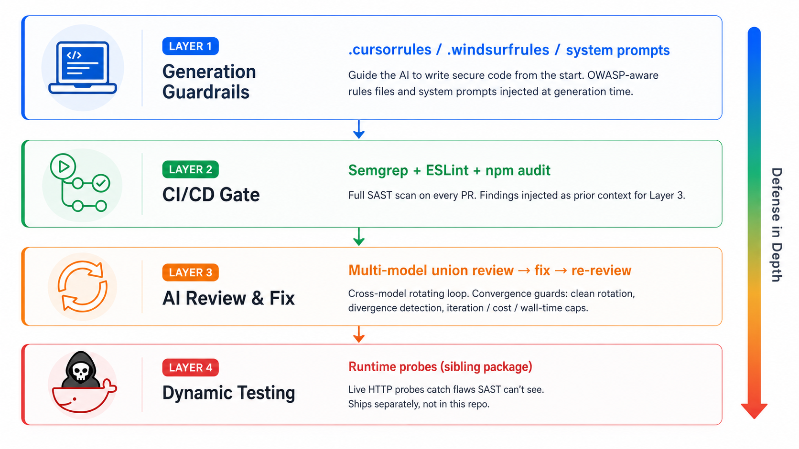
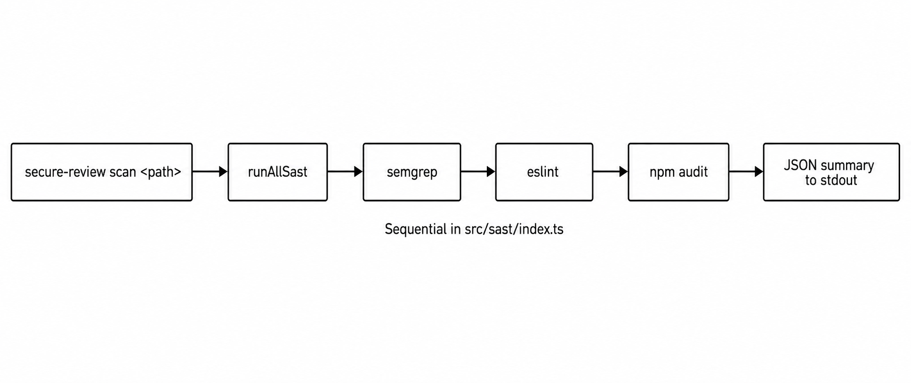
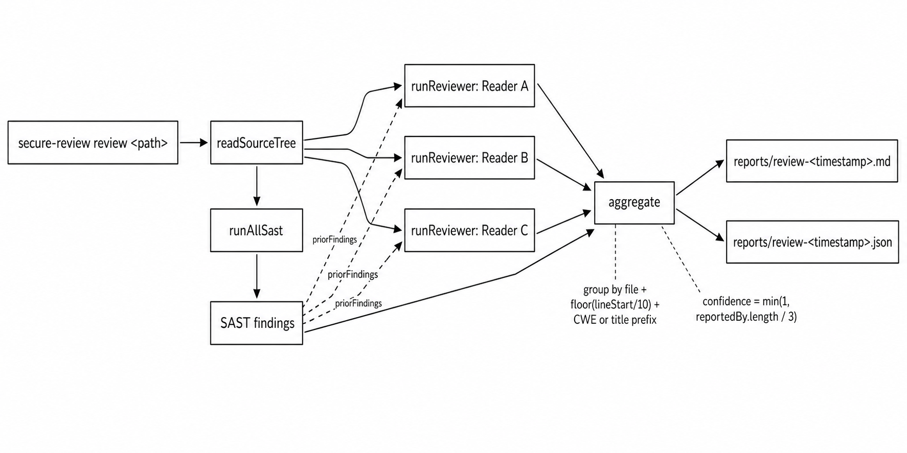
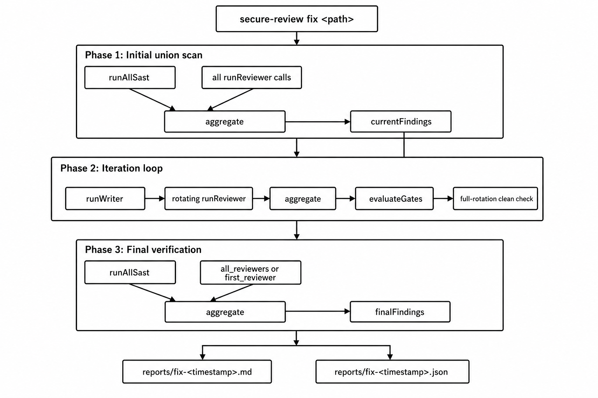
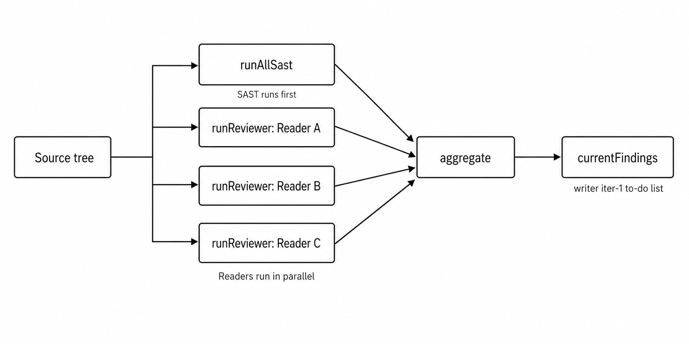
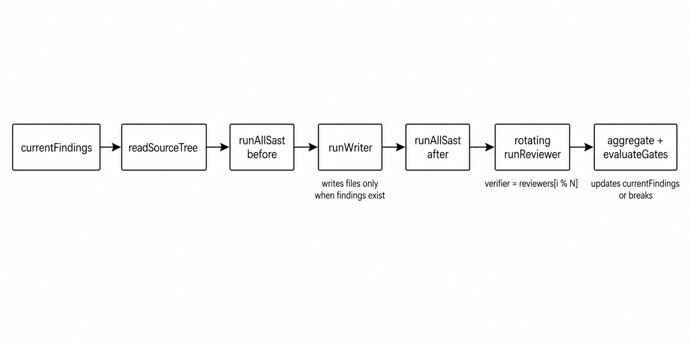
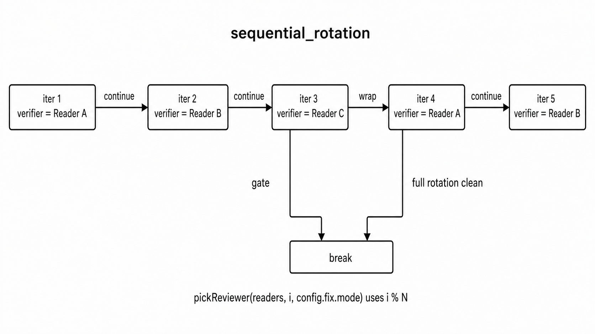
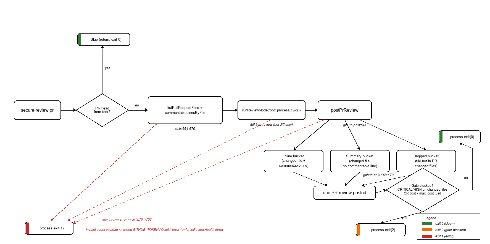

# Workflow

How `secure-review` actually executes each mode. Pseudo-code matches the source — every step here corresponds to real code in `src/modes/` and `src/roles/`.

**Layer 4** (live HTTP probes, ZAP/Nuclei, `attack` / `attack-ai` CLIs) is implemented in the sibling package **[`secure-review-runtime`](https://github.com/sstaempfli/secure-review-runtime)**, not in this repo. See that repo's WORKFLOW for the runtime probing methodology.

> The design choices in this tool are direct responses to failure modes we measured in a controlled study we ran. If something looks over-engineered, the next section explains which finding motivates it.

---

## Why this design exists

`secure-review` is a direct response to four failure modes we measured in a controlled study we ran on how well teams can validate AI-generated code with the tools available today. Three of those failure modes get descriptive short-names that are used throughout the rest of this document:

- **SAST-blind failure mode** — off-the-shelf SAST (Semgrep, ESLint Security) misses most AI-generated bugs and is mostly silent or false-positive-heavy on AI-generated code.
- **Loop-divergence failure mode** — a single-agent scan→fix→scan loop tends to grow the finding count and the LOC instead of shrinking them.
- **Single-model self-review failure mode** — the same agent that found an issue often fails to fix it; resolution rates on a single-model loop are unreliable and sometimes negative.

Each of the design choices below maps to one of these failure modes.

| Empirical finding | Design response in `secure-review` |
|---|---|
| **SAST-blind failure mode** — Semgrep found 0 code-level vulnerabilities in 23 of 24 AI-generated baselines (547 rules across JS/TS/Node.js/OWASP). ESLint Security was mostly false positives. | SAST is treated as **prior context** for AI readers, not as the driver. `inject_into_reviewer_context: true` tells readers *"here's what static rules saw — focus on what they miss."* |
| **Loop-divergence failure mode** — in 4 of 6 single-agent fix-loop runs we measured, the third iteration had *more* findings than the second. LOC grew 33–86%. | `fix` mode requires **N consecutive clean iterations** by *different* readers (`consecutiveCleanIters >= N`), gates on `block_on_new_critical`, and bounds work via `max_iterations`, `max_cost_usd`, and `max_wall_time_minutes`. Convergence is enforced, not assumed. |
| **Single-model self-review failure mode** — independent AI review found 24–43 real issues per run, but resolution after the same agent's fix was 0–54%, occasionally negative. | **Cross-model rotating verifier** + **final verification with `all_reviewers`**. A single model "satisfying itself" is exactly this failure mode. |
| **False-positive control** — a stated design goal is *"catch vulnerabilities reliably without overwhelming developers with false positives."* | Aggregation is FP-control machinery: 10-line bucketing per `{file, line-bucket, cwe-or-title-prefix}` so cross-model relabelings of the same CWE merge instead of double-counting, `confidence = min(1, \|reportedBy\| / 3)` so single-source noise is visibly downweighted, and an optional baseline file (`.secure-review-baseline.json`) lets users mark known-acceptable findings (severity-aware: a stale `LOW` baseline can no longer hide a later `CRITICAL` in the same bucket). See [§ False positives](#false-positives). |

The rest of this document describes *what* the tool does. The two cross-cutting concerns this design exists to address — false-positive suppression and convergence — get dedicated sections at the end.

---

## Defense in depth

The validation pipeline this tool fits into has four layers. `secure-review` implements **Layers 2–3** (static + AI review). Layer 1 (generation-time guardrails) is something you set up in your AI assistant; Layer 4 (live HTTP probing) ships in the sibling package [`secure-review-runtime`](https://github.com/sstaempfli/secure-review-runtime).



- **Layer 1 — Generation Guardrails.** `.cursorrules`, `.windsurfrules`, OWASP-aware system prompts. Guide the AI to write secure code from the start, before any code exists to review. Out of scope for this package — you configure this in your IDE / AI assistant.
- **Layer 2 — CI/CD SAST gate.** Semgrep + ESLint + `npm audit` on every PR. Findings are injected as prior context for Layer 3 readers via `inject_into_reviewer_context: true`, not used as a standalone gate (see the SAST-blind failure mode above).
- **Layer 3 — AI review and fix.** Multi-model union review with a cross-model rotating fix loop. Convergence guards — clean-rotation requirement, divergence detection, and hard bounds on iterations / cost / wall-time — are motivated by the loop-divergence and single-model self-review failure modes.
- **Layer 4 — Runtime probing.** Live HTTP probes (`attack`, `attack-ai`, ZAP, Nuclei) catch flaws SAST and static AI review can't see. Ships in [`secure-review-runtime`](https://github.com/sstaempfli/secure-review-runtime), not in this package.

---

## Mapping modes to pipeline layers

How the five modes map to the defense-in-depth pipeline.

| `secure-review` mode | Pipeline layer | Notes |
|---|---|---|
| `scan` | Layer 2 | Per the SAST-blind failure mode, intentionally insufficient on its own — useful as fast triage, not as a security gate. |
| `review` | Layers 2–3 (review only) | One-shot multi-model review. Adds the multi-reader union + confidence scoring that a single-agent review lacks. |
| `fix` | Layers 2–3 | Full review → fix → re-review with the rotation + convergence guards motivated by the loop-divergence and single-model self-review failure modes. |
| `pr` | Layers 2–3, gated | Commit-time validation scoped to the PR diff (static review only in core). |

Layer 4 (live HTTP probing) is intentionally separate from static review and ships in **[`secure-review-runtime`](https://github.com/sstaempfli/secure-review-runtime)**.

---

## Roles

Two distinct roles. They never overlap.

| Role | Reads code? | Edits files? | Count |
|---|---|---|---|
| **Reader** | Yes — analyzes files, reports findings | **No** | 1..N (configured) |
| **Writer** | Reads code as context | **Yes — the only role that modifies files** | Exactly 1 |

A "reader" and a "writer" can be the **same model** with different system prompts (skills) — they're distinct *roles*, not distinct models. In the default config, OpenAI `gpt-4o-mini` appears once as a reader (with `web-sec-reviewer.md` skill) and could appear again as the writer (with `secure-node-writer.md` skill). Different jobs, same brain.

### Terms used throughout this doc

The doc uses three closely-related words for the same underlying actor — they're not synonyms by accident, each one means something specific:

| Term | Where it appears | What it refers to |
|---|---|---|
| **Reader** | Role tables, narrative prose, diagrams | The role: a model that scans code and reports findings, never edits files. |
| **Reviewer** | Config keys (`reviewers:` in `.secure-review.yml`), function names like `pickReviewer()` | The configured-list term. The `reviewers:` array in YAML is the list of readers. |
| **Verifier** | `fix`-mode pseudocode | The specific reader chosen to audit a given iteration in `fix` mode (rotates per `config.fix.mode`). |

Plus two dataflow terms used in the `fix`-mode pseudocode:

- **`currentFindings`**: the writer's to-do list for the next iteration — initially the union scan output, then the latest verifier+SAST aggregate.
- **Final verification**: a post-loop scan (optional) that re-runs *all* readers in parallel as a safety net against single-verifier blind spots.

---

## `scan` mode — SAST only

The simplest mode. No LLM calls, no API keys required.



<details><summary>Pseudo-code</summary>

```
1. Load `.secure-review.yml` and pass the requested path to `runAllSast`
2. Run each enabled SAST tool sequentially (in src/sast/index.ts order):
     - semgrep (rulesets: `p/javascript`, `p/typescript`, `p/nodejs`, `p/owasp-top-ten` — explicit registry packs, not `--config auto`)
     - eslint  (via `npx --no-install eslint --format json <path>`)
     - npm audit (with the requested path as cwd)
3. Normalize each tool's output to the unified Finding schema
4. Print summary as JSON to stdout; no report file written
```
</details>

> SAST tools run sequentially rather than in parallel — they're typically I/O- and CPU-light, the orchestration overhead of `Promise.all` rarely pays off, and sequential execution makes failure attribution easier.

Use it when you want a fast, free, AI-free triage.

---

## `review` mode — multi-model parallel one-shot

SAST runs first, then every reader scans the same code. Findings are merged by `{file, line-bucket, cwe-or-title-prefix}` — overlapping findings at the same location merge ONLY when they share a CWE (or, when CWE is missing, a 24-char title prefix). Two genuinely-distinct vulnerabilities in the same 10-line bucket of the same file (e.g., a SQL injection at line 7 and a command injection at line 13) stay separate. Cross-model agreement on the same CWE still merges; confidence per finding is `min(1, |reportedBy| / 3)` so a finding flagged by 2 of 3 reporters is high-confidence.



<details><summary>Pseudo-code</summary>

```
1. Read source tree
2. Run all SAST tools (sequential — semgrep, then eslint, then npm-audit)
3. Start reviewer calls. If config.review.parallel == true (default), readers
   run in parallel via Promise.all; if false, they run one at a time in the
   configured order. Each reader receives:
                    - the code
                    - the SAST findings as prior context (if config.sast.inject_into_reviewer_context)
                    - its own role-specific skill prompt
4. Aggregate:
     allFindings = union(reader_A.findings,
                         reader_B.findings,
                         reader_C.findings,
                         SAST.findings)
     deduped     = group by {file, line-bucket, cwe || titlePrefix24}  # v2-file-bucket-cwe
                   merge overlaps; reportedBy = union of names
                   confidence = min(1, |reportedBy| / 3)
5. Apply baseline (if `.secure-review-baseline.json` is present or `--baseline` set):
     suppressed = findings whose fingerprint is in the baseline → excluded from
                  the headline `findings` array but kept on the output for
                  transparency (count surfaced in logs and the report)
6. Write report (markdown + JSON evidence)
```
</details>

**Output**: `reports/review-<timestamp>.{md,html,json}`. No file mutations.

**When to use**: any time you want a security report on a codebase without changing it. Cheapest mode that uses LLMs.

---

## `fix` mode — cross-model rotating loop (REDESIGNED in 0.5.0)

The mode that does the actual work of fixing security issues. It uses **rotation across iterations** so the writer can never settle into "code that satisfies one specific model" — every iteration a different reader audits with fresh eyes / different blind spots.

> **0.5.0+ semantics** — if you read older docs (or a fork on an older version), the fix-mode loop worked differently before. See [CHANGELOG.md](CHANGELOG.md) for the migration notes. The pseudo-code below describes 0.5.0+ only.

### High-level: all three phases at a glance



### Phase 1: Initial union scan



<details><summary>Pseudo-code</summary>

```
SAST(root)                           # sequential SAST tools
initialFindings = aggregate(
    reader_A.review(files) +         # readers run in PARALLEL (Promise.all)
    reader_B.review(files) +
    reader_C.review(files) +
    SAST.findings
)
currentFindings = initialFindings    # ← becomes the writer's iter-1 to-do list
                                     # (so no reader's blind spots get a free pass)
```
</details>

> SAST runs sequentially before the parallel reader fan-out. Readers always run in parallel in `fix` mode (no opt-out), so the `config.review.parallel` flag has no effect here.

> Gates are also evaluated **once after the initial scan** (before entering the loop) and **once after final verification** — not only inside the iteration loop. Cost and wall-time gates fire at all four sites (initial scan, every iteration, divergence break, final verification); severity gates (`block_on_new_critical` and `block_on_new_high` — same semantics as `block_on_new_critical` but firing on newly-introduced HIGH-severity findings) fire from iteration 1 onward (per `src/gates/evaluate.ts:32`). So cost/wall-time can short-circuit fix mode at any of four points; severity-regression at iter 1+ only.

### Phase 2: Iteration loop

#### One iteration in time



#### Rotation across iterations (sequential_rotation, N=3)



The writer is always the same model (configured in `writer:`). Only the verifier rotates. With `max_iterations >= N`, every reader audits at least once — guaranteeing cross-model coverage.

<details><summary>Pseudo-code</summary>

```
let consecutiveCleanIters = 0
let N = number of readers

for i in 0 .. (max_iterations - 1):
    # Rotation policy (config.fix.mode):
    #   "sequential_rotation" (default): verifier = readers[i % N]
    #   "parallel_aggregate":             verifier = readers[0]   # always first; no rotation
    verifier = pickReviewer(readers, i, config.fix.mode)

    # Step A: Writer applies fixes (writer is fixed; same model every iteration)
    filteredQueue = currentFindings.filter(min_confidence_to_fix, min_severity_to_fix)
    if filteredQueue.length > 0:
        writerRun = writer.fix(filteredQueue)     # writes files with sanitization
                                                  # (NUL replaced; other controls stripped)
    # else: skip writer call; verifier still runs to confirm clean state

    # Step B: Verifier audits (rotating reader = fresh eyes)
    sastAfter   = run all SAST tools
    afterFiles  = re-read source tree
    prior = config.sast.inject_into_reviewer_context ? sastAfter.findings : undefined
    verifierRun = verifier.review(afterFiles, prior=prior)

    findingsAfter = aggregate(verifierRun + sastAfter)
    findingsAfter = applyBaseline(findingsAfter, baseline).kept    # FP suppression
    findingsAfter = registry.annotate(findingsAfter)               # stable S-NNN IDs

    # (Static-only as of v1.0.0. The Layer-4 runtime hook — attacker model
    #  alongside writer/verifier — lives in the sibling package
    #  `secure-review-runtime`.)

    # Step C: Bookkeeping
    diff = compare(currentFindings, findingsAfter)
        .resolved   = in input but not in audit (matched by fingerprint)
        .introduced = in audit but not in input
        .newCritical = introduced.filter(severity == CRITICAL).count
        .newHigh     = introduced.filter(severity == HIGH).count

    # Step D: Divergence detection — record a flag if findings grow 2
    #   iterations in a row. The flag is consumed AFTER gates so a divergent
    #   iteration that ALSO introduces a new CRITICAL still goes through
    #   rollback + gateBlocked (Bug 6 fix; pre-fix the break ran here and
    #   silently bypassed gates).
    if findingsAfter.length > prevFindingCount: divergenceStreak += 1
    else:                                       divergenceStreak  = 0
    divergenceTriggered = (divergenceStreak >= 2)

    # Step E: Gate evaluation — break early on any condition. If the writer
    #   introduced new CRITICAL(s) AND a gate fires, the loop also restores
    #   the pre-iteration snapshot before stopping (Improvement 3, fix.ts).
    if config.gates.block_on_new_critical and newCritical > 0:    break  # rollback + gateBlocked=true
    if config.gates.block_on_new_high     and newHigh     > 0:    break  # rollback + gateBlocked=true
    if cumulativeCost > config.gates.max_cost_usd:                break
    if elapsedMs / 60000 > config.gates.max_wall_time_minutes:    break

    # Step F: Set up next iteration
    currentFindings = findingsAfter

    # Step G: Divergence break (after gates so rollback can fire)
    if divergenceTriggered: break

    # Step H: Stability check — only exit when N consecutive iters all clean
    if findingsAfter.empty:
        consecutiveCleanIters += 1
        if consecutiveCleanIters >= N: break    # ← full rotation clean
    else:
        consecutiveCleanIters = 0
```
</details>

### Phase 3: Final verification (parallel)

```
if config.fix.final_verification != 'none':
    finalFiles = readSourceTree(root, only)
    finalSast  = runSast(root)                                  # SAST runs first
    verifiers  = (config.fix.final_verification == 'all_reviewers')
                 ? readers
                 : [readers[0]]
    # All verifiers run in parallel via Promise.all; SAST findings are passed
    # as prior context only when sast.inject_into_reviewer_context is true.
    finalScan = parallel(
        reader.review(finalFiles,
                      prior = config.sast.inject_into_reviewer_context
                              ? finalSast.findings : undefined)
        for reader in verifiers
    )
    finalFindings = aggregate(finalScan + finalSast.findings)
# else 'none': skip
```

The final verification catches what individual iteration verifiers might have missed (because each iteration only had one reader's view). Recommended setting: `all_reviewers`.

### On the relationship between `max_iterations` and N

`max_iterations` (the loop ceiling) and N (the number of configured readers) are independent settings — they're not linked anywhere in code. The schema default is `3` (`src/config/schema.ts`); the `init` command sets `max_iterations` to N to match the reviewer count it scaffolds. You can change either freely in `.secure-review.yml`. What happens with each pairing:

| pairing | rotation sequence (N=3 → A,B,C) | behavior |
|---|---|---|
| `max_iter < N` (e.g. 2 vs 3) | A, B | reader C never audits during the loop; `consecutiveCleanIters >= N` early-exit cannot fire (would need 3 cleans, only 2 iters happen). Final verification still catches what C would have seen. |
| `max_iter == N` (3 vs 3, default) | A, B, C | every reader audits exactly once; clean 1:1 mapping |
| `max_iter > N` (e.g. 9 vs 3) | A, B, C, A, B, C, A, B, C | rotation wraps; early-exit can fire mid-loop after a full clean cycle |

Recommendation: keep `max_iterations >= N` so the early-exit is structurally reachable. In `.secure-review.yml`, the schema accepts `max_iterations` from 1 to 10; the CLI now rejects out-of-range overrides at parse time (since 0.5.12).

### Why this design

The two key invariants:

1. **Writer always sees the most comprehensive findings.** Iter 1 sees the full union. Iter 2+ sees the previous verifier's audit — which is itself a fresh-eyes pass by a different model on the writer's just-modified code.
2. **Loop only exits on full rotation clean.** A single lenient reader cannot end the loop while other readers still see issues. The `consecutiveCleanIters >= N` check forces a full cycle.

Together these prevent the failure mode that motivated the 0.5.0 redesign: a single iteration's reader saying "all clean" while the other readers (in the final verification) still find significant issues.

---

## `pr` mode — GitHub Action entrypoint

Runs a single static-review flow against a pull request. The legacy `INPUT_RUNTIME_MODE` input is gone, but `INPUT_MODE` is still read for backward compatibility (`action.yml:12` still exposes `mode`; `src/cli.ts:628, 899` still parse it). Its values are now redirected: `fix` maps to `--autofix` (itself a deprecated no-op), and `attack` / `attack-ai` print a deprecation warning pointing users at [`secure-review-runtime`](https://github.com/sstaempfli/secure-review-runtime). The only practical knob from the pre-v1 surface is the deprecated `--autofix` flag, which is now a no-op kept only for backward compatibility with existing workflow YAML. Runtime probing moved to [`secure-review-runtime`](https://github.com/sstaempfli/secure-review-runtime).

Runs `review` mode on the full checkout, then filters aggregated findings against the PR diff before posting a single review with line-anchored comments where GitHub permits them.



<details><summary>Pseudo-code</summary>

```
1. Verify PR context: GITHUB_EVENT_PATH, owner/repo/pr_number
2. Skip if PR is from a fork (no secret access)
3. Fetch PR file list, parse diffs into commentable line numbers per file
4. Always run runReviewMode on the full checkout (full multi-reader scan + SAST)
   — no INPUT_MODE branching; the deprecated --autofix flag is a no-op
5. Hand all findings + the per-file commentable-line map to `postPrReview()`
   (defined in src/reporters/github-pr.ts). Inside, findings are split into 3 buckets:
     - inline:        in a changed file AND on a commentable line → posted as inline review comment
     - summary:       in a changed file BUT on an unchanged line  → mentioned in review summary
     - dropped:       in an untouched file                        → not posted
6. `postPrReview` posts one PR review with all inline comments + summary text
7. The CLI applies `evaluatePrGates` (static gates)
     - CRITICAL/HIGH on changed files etc. → exit code 2 when blocked
```
</details>

Fork PR safety: forks don't have access to repo secrets — the static `pr` job exits early.

---

## Cross-cutting features

These cut across `review` and `fix` rather than belonging to a single mode. Each one targets a specific failure mode we observed.

### Stable finding identity across iterations

Inside a `fix` run, the same underlying bug must keep the same identity even when the verifier rephrases the title or shifts the reported line by ±a few — but a genuinely different CWE creates a new identity (correct behavior: a writer that "fixes" by relabeling the CWE should not silently inherit the old S-NNN). Without stable identity for rephrased findings, the per-iteration `introduced` count would be artificially inflated by relabeling.

```
fingerprint(f) = `${file}::${floor(lineStart / 10)}::${cwe || titlePrefix24}`
# v2-file-bucket-cwe — same CWE keeps the same identity even when the
# verifier rephrases the title; relabeling with a *different* CWE produces
# a NEW fingerprint (so a writer that "fixes" by changing CWE labels
# does not silently inherit the old S-NNN).
registry assigns S-NNN the first time a fingerprint is seen and
re-uses it for every subsequent sighting in the same session.
```

The stable ID surfaces in markdown reports next to the per-call `F-NN` aggregator id (e.g. `[S-007]`) so a reader can follow one bug across the iterations. Source: `src/findings/identity.ts`.

### Baseline / FP suppression

A `.secure-review-baseline.json` file records fingerprints of findings the user has triaged as known-acceptable. Both `review` and `fix` auto-detect a baseline file in the scan root, or take an explicit `--baseline <path>` (or `--baseline none` to opt out). Fingerprints in the baseline are filtered:

- before the writer ever sees them in `fix` mode (saves writer cost);
- after each iteration's verifier audit (so suppressed findings don't reappear in the diff);
- before the headline `findings` array is written to the report (suppressed findings are still kept on the output object for transparency, and counted in logs).

**Severity-aware suppression (v1.0.0).** A baseline match suppresses an incoming finding ONLY when the incoming severity is `≤` the baselined severity. A stale `LOW` baseline can no longer hide a later `CRITICAL` in the same bucket — escalated findings flow through and the loader logs a warning. Auto-load also logs a warning so users notice when a baseline is silently affecting their numbers (pass `--baseline none` to disable).

Create / update the baseline from a previous report's JSON via `secure-review baseline reports/review-*.json [--reason "test fixture"] [--merge]`. Source: `src/findings/baseline.ts`.

### Incremental mode (`--since <ref>`)

`secure-review review <path> --since main` and `secure-review fix <path> --since main` only review files that `git diff --name-only --diff-filter=ACMR <ref>` reports as changed (`<path>` is required — see `src/cli.ts:426, 504`). The whole pipeline (SAST, AI readers, writer, snapshot/restore) is restricted to that file set, so on a tight feedback loop you pay only for the files that changed since the ref. Deleted files are excluded automatically (we can't review what's not in the working tree).

### Pre-run cost estimate

Before the AI calls fire, `review` and `fix` print a cost estimate based on the actual file set after filtering, the configured reader/writer models, and `gates.max_cost_usd`:

```
Pre-run cost estimate (fix):
  Range:  $1.18 – $2.18   (point: $1.68)
  Tokens: 96.0k input · 28.0k output

  Per model:
    reviewer codex   gpt-5-codex          5 calls  $0.45
    reviewer sonnet  claude-sonnet-4-6    3 calls  $0.30
    reviewer gemini  gemini-2.5-pro       3 calls  $0.13
    writer   writer  claude-sonnet-4-6    3 calls  $0.80

  Cap (gates.max_cost_usd): $20.00  — well within cap

Proceed? [y/N]
```

Interactive shells get the prompt; `--yes` skips it; `--no-estimate` skips the preview entirely (useful for batched reproducibility scripts). In non-interactive contexts (CI, piped stdout) the estimate is still printed but the run proceeds without prompting — `gates.max_cost_usd` remains the budget contract.

Standalone preview without invoking any model: `secure-review estimate ./src --mode fix`. Source: `src/util/estimate-cost.ts`.

---

## SAST integration

SAST runs before readers and feeds them context (configurable via `inject_into_reviewer_context`).

```
SAST tools currently wrapped:
  - semgrep   (explicit registry packs: p/javascript, p/typescript, p/nodejs, p/owasp-top-ten — not `--config auto`)
  - eslint    (via local `npx --no-install eslint`; skipped if unavailable or not runnable)
  - npm audit (runs `npm audit --json` with the scan path as cwd)
```

Each tool's output is normalized to the same `Finding` schema as AI readers, so they all participate in the same dedup + confidence calculation. A finding caught by both semgrep and gemini-flash gets `confidence = min(1, 2/3) = 0.67`.

When `inject_into_reviewer_context: true`, SAST findings are passed to AI readers as **prior context** ("here's what static rules already found — focus on what they miss"). This usually makes AI readers find genuinely different bugs instead of duplicating SAST output.

---

## Aggregation algorithm

Used by both `review` mode (one-shot) and `fix` mode (each verification step).

```
function aggregate(rawFindings):
    grouped = group rawFindings by key:
                  key = `${file}::${floor(lineStart / 10)}::${cwe || titlePrefix24}`
    # v2-file-bucket-cwe — see `findingFingerprint` in src/findings/identity.ts.
    # CWE is in the key so two genuinely-distinct vulns in the same 10-line
    # bucket (e.g. SQL injection CWE-89 at line 7 vs command injection CWE-78
    # at line 13) stay separate. CWE-less findings fall back to a 24-char
    # title prefix so two reviewers reporting "Missing authentication on /admin"
    # without a CWE still merge, but "Missing authentication" and "Hardcoded
    # credential" without CWEs in the same bucket stay separate. The
    # `fingerprint_algorithm` field in evidence JSON records which algorithm
    # version produced the run for cross-run reproducibility.
    for each group:
        merged.id          = synthesized "F-NN" (assigned in iteration order)
        merged.title       = first title that created the bucket
        merged.description = longest description
        merged.severity    = highest severity in group
        merged.reportedBy  = union of all names in group
        merged.confidence  = min(1, |reportedBy| / 3)
    return merged_findings  # insertion-ordered; callers sort if they want order
```

The `floor(lineStart / 10)` line-bucket is intentionally fuzzy — different reviewers often point at slightly different lines for the same bug ("line 24 in Anthropic's view" vs "line 26 in OpenAI's view"). Bucketing by 10-line windows merges these into one finding. The same fingerprint function powers the stable-identity registry and the iteration diff, so aggregation, diffing, and baseline matching are guaranteed to agree on what counts as "the same bug".

---

## False positives

A stated design goal — *"catch vulnerabilities reliably without overwhelming developers with false positives"* — makes FP suppression a first-class concern, not an afterthought. Four mechanisms work together:

1. **Inter-reporter corroboration via `confidence`.** A finding reported by only one source receives `confidence = min(1, 1/3) ≈ 0.33`. Findings corroborated by 2 or 3 distinct sources score 0.67 / 1.0 respectively. Reports surface confidence prominently so single-source noise renders as low-confidence by construction — the reader can triage by confidence threshold without losing data.
2. **Fuzzy bucketing in `aggregate()`.** Two readers reporting the same bug (same CWE) at lines 24 and 26 collapse into one finding via `${file}::${floor(lineStart / 10)}::${cwe || titlePrefix24}` (both land in bucket 2); a third reader pointing at line 31 lives in bucket 3 and stays separate — see [§ Aggregation algorithm](#aggregation-algorithm). Without this, duplicate noise from the SAST-blind failure mode (e.g. multiple readers re-flagging the same `detect-object-injection` site that ESLint Security already flagged) would inflate the apparent finding count and look like an FP problem when it's actually a deduplication problem.
3. **SAST-as-prior-context, not SAST-as-driver.** Per the SAST-blind failure mode, SAST on AI-generated code is mostly silent or FP-heavy. Passing SAST output to readers as *prior context* with the framing "focus on what these missed" steers reader budget toward novel issues instead of duplicating low-signal SAST output.
4. **Baseline file for known-acceptable findings.** A `.secure-review-baseline.json` records fingerprints of findings the user has explicitly triaged as known/accepted (durable TPs they tolerate, or FPs the model keeps re-finding). Subsequent runs suppress them — the writer never sees them in the fix loop, the report counts them under "baselined" instead of mixing them into "remaining". See [§ Cross-cutting features](#cross-cutting-features).

What the tool deliberately does **not** do: assign a final TP/FP label. That remains a human judgement call. The JSON evidence preserves `reportedBy`, `confidence`, and per-reporter raw findings so downstream analysis can compute TP/FP rates with whatever convention the consuming pipeline prefers.

---

## Convergence

The loop-divergence failure mode showed that naive scan→fix→scan loops either fail to converge or actively regress (4 of 6 single-agent runs we measured got *worse* by iteration 3). `fix` mode encodes six exit mechanisms — five are bounds, one is a *positive* convergence criterion:

| Exit mechanism | Type | Failure mode it prevents |
|---|---|---|
| `consecutiveCleanIters >= N` | **Convergence** | A single lenient reader ending the loop while readers it didn't rotate to would still flag issues (the single-model self-review failure mode). |
| `divergenceStreak >= 2` | Bound (regression detector) | The writer is making the codebase worse, not better — stop before the LOC-growth runaway we measured at 33–86%. |
| `block_on_new_critical` | Bound | An iteration that introduces new CRITICAL findings is treated as a regression and short-circuits the loop (the "fixes make it worse" loop-divergence failure mode); on this exit the loop also restores the pre-iteration snapshot. |
| `max_cost_usd` | Bound | Runaway loops in cases where convergence is genuinely unreachable for the given codebase / model combination. The pre-run cost estimate (see [§ Cross-cutting features](#cross-cutting-features)) makes the budget contract visible *before* spending. |
| `max_wall_time_minutes` | Bound | Wall-clock ceiling for the same runaway scenarios — independent from cost so a fast-but-cheap loop and a slow-but-cheap loop both have an exit. |
| `max_iterations` (≤ 10) | Bound | Hard ceiling on write churn; bounds the LOC-growth runaway we measured at 33–86%. |

The post-loop **final verification with `all_reviewers`** is a separate safety net for a different failure mode: an iteration verifier saying "clean" while readers it didn't rotate to would still flag issues. It is recommended (and the default for new configs created by `init`) precisely because it directly addresses the single-model self-review failure mode's low single-agent resolution rate.

### Cost gates are not theoretical

A single-agent fix loop (3 iterations) we measured ran at **145K–188K output tokens** on one small task alone — roughly $2–3 per run on Sonnet 4.6's April 2026 pricing. With multi-model rotation each `fix`-mode iteration adds a writer call plus a verifier call (and the reader fan-out runs once at the start and again at final verification). On a tight feedback loop, `max_cost_usd` and `max_wall_time_minutes` are the difference between a $5 PR check and a $50 one — they're not optional safety belts, they're the budget contract.

To run the same convergence analysis on your own runs, see [§ Output schema](#output-schema) for the exact JSON fields.

---

## Resilience layers

Three safety nets keep the tool running under transient failures:

1. **`withRetry()`** — exponential backoff for any provider call that throws a transient error (429, 5xx, `ECONNRESET`, "high demand", "fetch failed", `cause`-wrapped network errors, etc.). Defined in `src/util/retry.ts`. Default schedule: 3 attempts at 1s → 2s → fail. Adapters can override (the Anthropic adapter uses 1.5s → 3s, for example).
2. **Writer parse-failure retry** — if the writer's JSON output isn't parseable, retry once with a stricter "JSON ONLY, no prose" reminder. Catches Sonnet's occasional drift into prose-around-JSON.
3. **Anthropic strict-JSON prompt** — Claude 4 models don't support assistant prefilling, so the Anthropic adapter instead appends an explicit "respond with a single JSON object only" instruction to the user message when `jsonMode=true` (see `src/adapters/anthropic-api.ts`). Drops most prose drift at the source. (Earlier 0.5.x prefilled the assistant turn with `{`; replaced in v1.0.0 — see CHANGELOG.)

---

## Verifying locally

**This repository (`secure-review`)** implements static modes (`scan`, `review`, `fix`, …). Runtime modes (**`attack`** / **`attack-ai`**) live in **[`secure-review-runtime`](https://github.com/sstaempfli/secure-review-runtime)**.

1. **Automated suite (this repo)** — From the repo root: `npm run typecheck` and `npm test` (Vitest). Tests cover parsing, aggregation, static reporters, **`fix`** rotation / gates / reviewer health, and related CLI options — **not** live HTTP attack fixtures (those moved to **[`secure-review-runtime`](https://github.com/sstaempfli/secure-review-runtime)**).
2. **Runtime package** — Clone or open **[`secure-review-runtime`](https://github.com/sstaempfli/secure-review-runtime)**: `npm install && npm test` after linking `secure-review`. Use **`npx secure-review-runtime attack …`** / **`attack-ai …`** against a local server when validating Layer 4.
3. **No-key smoke** — `secure-review scan <path>` loads config and runs SAST only (stdout JSON). `secure-review --help` confirms static CLI wiring.
4. **Deterministic Layer 4** — With your app listening, run **[`secure-review-runtime`](https://github.com/sstaempfli/secure-review-runtime)** from that repo, then inspect `reports/attack-*.json` (`condition: "F-attack"`).

Full checklist (including `estimate`, `build`, and `build:action`): [README § Developing and verifying](README.md#developing-and-verifying).

---

## Known limitations

Scope boundaries — none of these are bugs, they're trust calibrations.

- **Automation boundary.** **This package** covers static + AI review (layers 1–3). **Layer 4** — deterministic `attack`, bounded same-origin `attack-ai`, optional **ZAP** / **Nuclei**, and **browser-login-script** hooks — ships in **[`secure-review-runtime`](https://github.com/sstaempfli/secure-review-runtime)**. Built-in probes there remain **bounded** (same-origin-safe categories in `attack-ai`; no autonomous exploit chains beyond configured scanners **plus** Nuclei traffic you explicitly enable).
- **Non-determinism.** AI readers and writers produce different outputs on the same input. The JSON evidence records `model_version` per run, but temperature and seed are not pinned uniformly across providers (and some providers don't expose seeds at all). Plan multiple runs when reproducibility matters.
- **TP/FP labeling stays human.** Aggregation downweights single-source findings via `confidence`, but final true-positive vs. false-positive classification still requires a human or a separate evaluation harness. The tool surfaces evidence; it does not adjudicate.
- **Provider model evolution.** Models change between runs — a known threat to reproducibility. JSON evidence captures `model_version` and `timestamp` so historical comparisons remain auditable even when not byte-reproducible.
- **Ground-truth-free fix success rate.** `findings_resolved` counts findings present in the initial scan but absent in final verification. It does **not** prove the underlying vulnerability was fixed — only that no reader plus SAST reported it. This is exactly the gap the single-model self-review failure mode measured (resolution rates of 0–54% on a single-model loop). Multi-model rotation reduces this risk but does not eliminate it.

---

## Output schema

`review` mode emits three report files per run; `fix` mode emits four (the writer's diff is saved alongside):

- `reports/<mode>-<timestamp>.md` — human-readable Markdown report.
- `reports/<mode>-<timestamp>.html` — self-contained interactive report (inline CSS + JS, no external assets). Sortable/filterable findings list, collapsible details per finding, fix-mode adds a before/after delta + per-iteration timeline. Works offline; safe to commit, attach to a PR comment, or open from a CI artifact.
- `reports/<mode>-<timestamp>.json` — structured evidence JSON, schema-stable across versions (defined in `src/findings/schema.ts`).
- `reports/fix-<timestamp>.patch` *(fix mode only)* — unified diff of the writer's changes across the run, written by `src/cli.ts:576-593`.

**[`secure-review-runtime`](https://github.com/sstaempfli/secure-review-runtime)** (`attack` / `attack-ai`) emits:

- `reports/attack-<timestamp>.md` — human-readable runtime probe report.
- `reports/attack-<timestamp>.json` — structured runtime evidence (`condition: "F-attack"`) including `target_url`, `checks`, `runtime_findings`, `gate_blocked`, and `gate_reasons`.

- `reports/attack-ai-<timestamp>.md` — human-readable AI attack simulation report.
- `reports/attack-ai-<timestamp>.json` — structured runtime evidence (`condition: "F-attack-ai"`) including `target_url`, `crawled_pages`, `hypotheses`, `probes`, `runtime_findings`, safety `limits`, `gate_blocked`, and `gate_reasons`.

The JSON schema is stable across versions. **`secure-review`** runs tag themselves with `condition: "F-review"` or `"F-fix"`; **[`secure-review-runtime`](https://github.com/sstaempfli/secure-review-runtime)** uses `"F-attack"` and `"F-attack-ai"`. The `condition` field is an opaque tag used by downstream analysis scripts to identify run type — treat it as a fixed string label, not a semantic claim.

### Mapping to common metrics

For pipelines that want to compute standard evaluation metrics from the JSON evidence:

| Metric | JSON field(s) | Notes |
|---|---|---|
| **True-positive rate** (proxy) | `findings[].confidence`, `findings[].reportedBy` | Per-finding signal, not per-run. Use confidence threshold to approximate; final TP/FP labels require human review. |
| **Fix success rate** | `findings_resolved / total_findings_initial` (also pre-computed as `resolution_rate_pct`) | Resolution rate across the fix loop. |
| **Convergence** | `per_iteration[].findings_in` vs `findings_out`; top-level `new_findings_introduced` | "Did fixing make it worse?" is `new_findings_introduced > 0` or any `findings_out > findings_in` across iterations. |
| **Severity distribution** | `findings_by_severity_initial`, `findings_by_severity_after_fix` | Same `SeverityBreakdown` shape used throughout the codebase. |
| **Cost per run** | `total_cost_usd`, `per_iteration[].cost_usd` | USD-denominated. |
| **Iteration count** | top-level `iterations`, `per_iteration[].iteration` | Number of feedback iterations the loop actually ran. |
| **Non-determinism control** | `model_version`, `session_id`, `timestamp`, `run` | Enough metadata to identify and replay any single run. |
| **CRITICAL-introduced regressions** | `notes` (set to `"Gate blocked: ..."` when applicable) | Otherwise inferable from `per_iteration` deltas + `findings_by_severity_*`. |
| **Per-iteration verifier identity** | `per_iteration[].reviewer` (alias `verifier`) | Lets you reconstruct which model audited which iteration in `fix` mode — necessary for cross-model coverage analysis. |

See [README's Evidence JSON section](README.md#evidence-json) for the complete schema reference, and `src/findings/schema.ts` for the runtime Zod schema.
